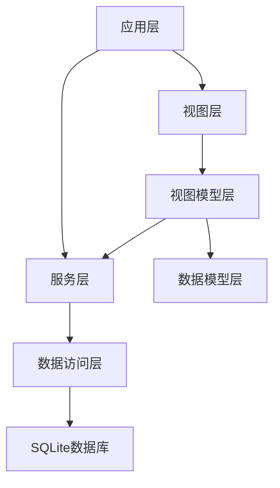

# BloodReg 项目 Wiki

## 1. 项目概述

BloodReg 是一个基于 WPF 的献血信息登记工具，旨在提高献血信息录入效率，替代传统的 Excel 录入方式。

- **项目类型**：桌面应用程序
- **开发技术**：WPF、.NET 8/9/10、SqlSugar ORM、SQLite
- **主要功能**：多类型人员献血信息登记、管理、查询和导出
- **应用场景**：医疗机构、高校、企事业单位等需要进行献血信息管理的场景

## 2. 项目架构

### 2.1 整体架构

BloodReg 采用 MVVM (Model-View-ViewModel) 架构模式，结合依赖注入和服务主机模式，实现了清晰的分层结构。



### 2.2 目录结构

```
BloodReg/
├── Assets/              # 应用资源文件
├── Converters/          # 数据转换器
├── Extensions/          # 扩展类
├── Helpers/             # 辅助工具类
├── Models/              # 数据模型
├── Services/            # 服务类
│   └── Contracts/       # 服务接口
├── Styles/              # 样式文件
├── ViewModels/          # 视图模型
├── Views/               # 视图
│   ├── Dialogs/         # 对话框
│   └── Pages/           # 页面
├── App.config           # 应用配置
├── App.xaml             # 应用入口XAML
├── App.xaml.cs          # 应用入口代码
└── BloodReg.csproj      # 项目文件
```

### 2.3 核心模块

| 模块 | 主要职责 | 文件位置 | 引用 |
|------|---------|---------|------|
| 学生管理 | 学生献血信息的登记、查询、编辑和删除 | ViewModels/StudentViewModel.cs | [StudentViewModel.cs](file:///workspace/BloodReg/ViewModels/StudentViewModel.cs) |
| 教职工管理 | 教职工献血信息的登记、查询、编辑和删除 | ViewModels/TeacherViewModel.cs | [TeacherViewModel.cs](file:///workspace/BloodReg/ViewModels/TeacherViewModel.cs) |
| 留学生管理 | 留学生献血信息的登记、查询、编辑和删除 | ViewModels/InternationalStudentViewModel.cs | [InternationalStudentViewModel.cs](file:///workspace/BloodReg/ViewModels/InternationalStudentViewModel.cs) |
| 校外人员管理 | 校外人员献血信息的登记、查询、编辑和删除 | ViewModels/OutsidePeopleViewModel.cs | [OutsidePeopleViewModel.cs](file:///workspace/BloodReg/ViewModels/OutsidePeopleViewModel.cs) |
| 数据库管理 | 数据库的导入导出功能 | ViewModels/DatabaseImportDialogViewModel.cs, ViewModels/DatabaseExportDialogViewModel.cs | [DatabaseImportDialogViewModel.cs](file:///workspace/BloodReg/ViewModels/DatabaseImportDialogViewModel.cs) |
| 设置管理 | 应用程序设置管理 | ViewModels/SettingsViewModel.cs | [SettingsViewModel.cs](file:///workspace/BloodReg/ViewModels/SettingsViewModel.cs) |

## 3. 核心功能

### 3.1 多类型人员信息管理

BloodReg 支持四种类型人员的献血信息管理：

| 人员类型 | 关键信息 | 特点 |
|---------|---------|------|
| 学生 | 姓名、学号、献血量、录入人 | 结构简单，适合学生群体 |
| 教职工 | 姓名、工号、手机号、账号、开户行、献血量、录入人 | 包含财务信息，方便后续补贴发放 |
| 留学生 | 姓名、中文名、学号、手机号、账号、开户行、护照号、国籍、生日、首次入境日期、微信号、献血量、录入人 | 信息全面，满足留学生特殊需求 |
| 校外人员 | 姓名、工号、身份证号、手机号、账号、开户行、献血量、录入人 | 适合校外参与献血的人员 |

### 3.2 数据操作功能

1. **信息录入**：支持快速录入各类人员的献血信息，包含数据验证
2. **信息查询**：支持按姓名或ID进行搜索
3. **信息编辑**：支持修改已录入的信息
4. **信息删除**：支持删除不需要的记录
5. **数据分页**：支持数据分页显示，可自定义每页显示条数
6. **数据库导入导出**：支持数据库的备份和恢复

### 3.3 用户界面功能

1. **导航系统**：通过导航栏快速切换不同功能模块
2. **操作提示**：通过消息提示框反馈操作结果
3. **数据验证**：输入数据时进行实时验证
4. **待办列表**：支持临时保存待录入的信息
5. **响应式设计**：适配不同屏幕尺寸

## 4. 技术实现

### 4.1 数据存储

BloodReg 使用 SQLite 作为数据库，通过 SqlSugar ORM 框架进行数据操作：

```csharp
// 数据库连接配置
services.AddSingleton<ISqlSugarClient>(s =>
{
    SqlSugarScope sqlSugar = new(new ConnectionConfig()
    {
        DbType = DbType.Sqlite,
        ConnectionString = "DataSource=database.db",
        IsAutoCloseConnection = true,
    });
    return sqlSugar;
});
```

### 4.2 依赖注入

使用 .NET 内置的依赖注入容器，实现服务的注册和解析：

```csharp
// 服务注册
services.AddHostedService<ApplicationHostService>();
services.AddSingleton<IContentDialogService, ContentDialogService>();
services.AddSingleton<ISnackbarService, SnackbarService>();
services.AddSingleton<INavigationService, NavigationService>();
```

### 4.3 MVVM 实现

使用 CommunityToolkit.Mvvm 实现 MVVM 模式：

```csharp
// 视图模型示例
public partial class StudentViewModel : ObservableObject, INavigationAware
{
    [ObservableProperty]
    private string _name = string.Empty;

    [ObservableProperty]
    private string _studentID = string.Empty;

    [RelayCommand]
    private async Task AddAsync()
    {
        // 添加逻辑
    }
}
```

### 4.4 导航系统

使用 Wpf.Ui 提供的导航服务实现页面导航：

```csharp
// 导航项配置
NavigationItems = [
    new NavigationViewItem()
    {
        Content = "主页",
        Icon = new SymbolIcon { Symbol = SymbolRegular.Home24 },
        TargetPageType = typeof(Views.Pages.Home),
    },
    // 其他导航项
];
```

## 5. 特色功能

### 5.1 多类型人员管理

针对不同类型人员的特点，设计了不同的数据结构和录入界面，满足各种场景的需求。

### 5.2 智能搜索

支持按姓名或ID进行智能搜索，快速定位所需信息。

### 5.3 数据验证

实时数据验证，确保录入信息的准确性和完整性。

### 5.4 待办列表

临时保存待录入的信息，提高工作效率。

### 5.5 数据库导入导出

支持数据库的备份和恢复，确保数据安全。

### 5.6 分页功能

支持数据分页显示，可自定义每页显示条数，提高大数据量下的操作效率。

## 6. 解决的痛点

1. **替代Excel录入**：相比Excel，提供更专业、更高效的信息录入界面
2. **集中管理**：将各类人员的献血信息集中管理，方便查询和统计
3. **减少错误**：通过数据验证和重复检查，减少录入错误
4. **提高效率**：快速的信息录入、查询和管理功能，提高工作效率
5. **数据安全**：数据库备份和恢复功能，确保数据安全

## 7. 技术栈

| 技术/框架 | 版本 | 用途 | 引用 |
|----------|------|------|------|
| .NET | 8/9/10 | 开发平台 | [BloodReg.csproj](file:///workspace/BloodReg/BloodReg.csproj) |
| WPF | - | 界面框架 | [App.xaml](file:///workspace/BloodReg/App.xaml) |
| SqlSugar | - | ORM框架 | [App.xaml.cs](file:///workspace/BloodReg/App.xaml.cs) |
| SQLite | - | 数据库 | [App.xaml.cs](file:///workspace/BloodReg/App.xaml.cs) |
| CommunityToolkit.Mvvm | - | MVVM框架 | [StudentViewModel.cs](file:///workspace/BloodReg/ViewModels/StudentViewModel.cs) |
| Wpf.Ui | - | UI组件库 | [MainWindowViewModel.cs](file:///workspace/BloodReg/ViewModels/MainWindowViewModel.cs) |

## 8. 开发环境

- **IDE**：Visual Studio 2026
- **系统要求**：Windows 11 版本 21H2 或更高版本
- **工作负荷**：.NET 桌面开发（.Net 8/9/10）
- **可选插件**：XAML Styler for Visual Studio 2022

## 9. 未来发展方向

1. **数据统计分析**：增加数据统计和分析功能，生成献血趋势报告
2. **批量导入**：支持从Excel等格式批量导入数据
3. **云端同步**：支持数据云端备份和多设备同步
4. **移动端适配**：开发移动端应用，支持现场数据采集
5. **多语言支持**：增加多语言界面，满足国际化需求

## 10. 总结

BloodReg 是一个功能完善、界面友好的献血信息登记工具，通过现代化的技术栈和合理的架构设计，解决了传统Excel录入效率低、易出错的问题。它不仅满足了不同类型人员的献血信息管理需求，还提供了丰富的功能和良好的用户体验，是献血信息管理的理想解决方案。