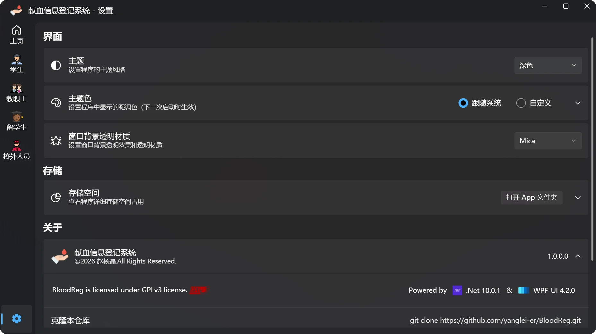

  

<h1 align="center">BloodReg</h1>

一个基于WPF的献血信息登记工具

## 简介
使用Excel进行信息录入效率较低，开发此工具提高录入效率。

## 🖼 截图

主界面

录入界面

设置界面

## ⌨️ 开发环境
[Visual Studio 2026](https://visualstudio.microsoft.com/zh-hans/vs)

- 系统要求
     - [Windows 11 版本 21H2 或更高版本：家庭版、专业版、专业教育版、专业工作站版、企业版和教育版](https://learn.microsoft.com/zh-cn/visualstudio/releases/2026/vs-system-requirements)

- 工作负荷
     - .NET 桌面开发（.Net 8/9/10）
     
- 插件
     -  [XAML Styler for Visual Studio 2022(可选)](https://marketplace.visualstudio.com/items?itemName=TeamXavalon.XAMLStyler2022) 
     
## 📄 引用
详见 [./docs/reference.md](docs/reference.md)   

## License
BloodReg is licensed under [GPLv3](./LICENSE).
Copyright © 2026 by Zhao Yanglei. 